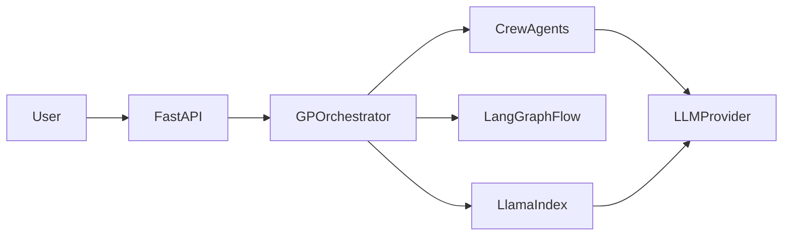

## Agentic MD Project Suite

This `AgenticSuite` monorepo collects multiple **agentic framework project skeletons** generated from your `.md` notes. Each subfolder will host an interview-ready, minimal but clean implementation that you can extend over time.

### Projects in this Suite

- **Shared utilities (`shared/`)**
  - Optional space for common config, logging, and typing helpers used across projects.

- **CrewAI SkillBot (`crewai_skillbot/`)**
  - **Origin**: `CrewAI.md`
  - **Idea**: Multi-agent SkillBot (TrendAgent, ResearchAgent, PracticeAgent, CodeAgent) focused on learning workflows.

- **LangGraph TaskFlow (`langgraph_taskflow/`)**
  - **Origin**: `LangGraph.md`
  - **Idea**: Project execution graph with tasks, dependencies, and state transitions.

- **AutoGen MentorBot (`autogen_mentorbot/`)**
  - **Origin**: `AutoGen.md`
  - **Idea**: Conversational mentor bot that guides a learner through topics using AutoGen-style agents.

- **LlamaIndex KnowledgeBot (`llamaindex_knowledgebot/`)**
  - **Origin**: `LamaIndex.md`
  - **Idea**: Data-aware Q&A bot built around a RAG-style pipeline using LlamaIndex.

- **GP System Agentic (`../gp_system_agentic/`)**
  - **Origin**: `Agentic.MD`
  - **Idea**: Multi-agent GP consultation backend (DoctorAgent + ReportAgent) exposed via FastAPI.

- **MCP Integration Notes (`mcp_integration_notes/`)**
  - **Origin**: `MCP.MD`
  - **Idea**: Design and minimal stubs for exposing the above projects via MCP-style adapters.

### Framework → Project Matrix

| Framework / Concept | Project Folder              | Idea Source (.md) | Primary Techniques                                      |
| --------------------| --------------------------- | ----------------- | --------------------------------------------------------|
| CrewAI              | `crewai_skillbot`          | `CrewAI.md`       | Multi-agent crew, role-based agents, stubbed tools      |
| LangGraph           | `langgraph_taskflow`       | `LangGraph.md`    | Task graph, state transitions, workflow simulation      |
| AutoGen             | `autogen_mentorbot`        | `AutoGen.md`      | Conversational agents, separation of tools vs decisions |
| LlamaIndex          | `llamaindex_knowledgebot`  | `LamaIndex.md`    | RAG pipeline skeleton, indexing and retrieval           |
| Agentic GP System   | `../gp_system_agentic`     | `Agentic.MD`      | Multi-agent GP flow, FastAPI backend, orchestration     |
| MCP-style Adapters  | `mcp_integration_notes`     | `MCP.MD`          | Adapter design, multi-framework integration             |

> Note: All listed folders exist now; `gp_system_agentic` is a sibling project under `projects/` (not nested inside `AgenticSuite/`).

### Quickstart (per-project pattern)

For each project directory (e.g., `gp_system_agentic/`), the recommended workflow is:

1. **Create and activate a virtual environment**
   ```bash
   python -m venv .venv
   # macOS/Linux
   source .venv/bin/activate
   # Windows (PowerShell)
   .venv\Scripts\Activate.ps1
   ```
2. **Install dependencies**
   ```bash
   pip install -r requirements.txt
   ```
3. **Run the project**
   - CLI-based projects: `python main.py`
   - FastAPI-based projects (e.g., `gp_system_agentic`):
     ```bash
     uvicorn app:app --reload
     ```

Each individual project folder is intentionally small and runnable, and can be extended with real LLM/tool integrations later.

### High-Level GP System Integration Diagram

The following mermaid diagram illustrates how the GP system conceptually ties together multiple frameworks in this suite:



This `AgenticSuite` folder is the home for all of these framework-based projects, giving you a single, coherent place to demonstrate modern agentic patterns across ecosystems, each one explicitly mapped back to its originating markdown note (`CrewAI.md`, `LangGraph.md`, `AutoGen.md`, `LamaIndex.md`, `Agentic.MD`, `MCP.MD`).

Each subfolder under `AgenticSuite` is a small, focused, interview-ready project skeleton that you can run, extend, and use in interviews to explain how different agentic frameworks, orchestrators, and data layers fit together into a larger system.

